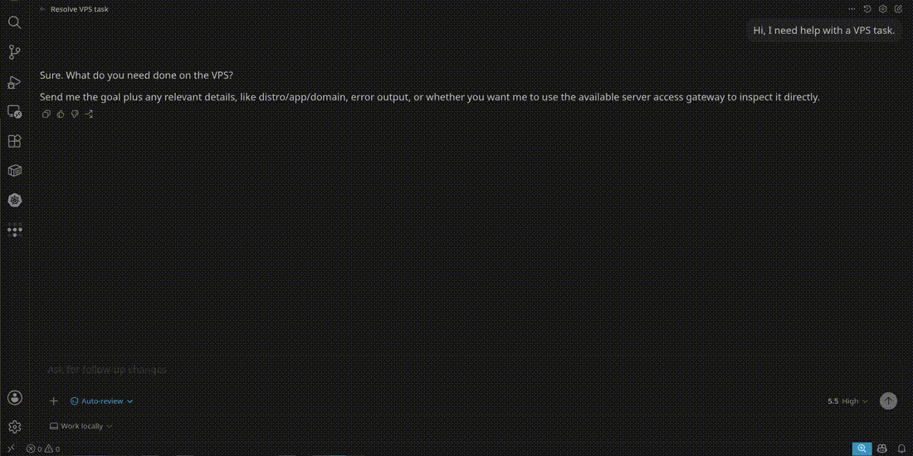

<div align="center">
  
  <h1>AIPermission</h1>
  <p><strong>Local permission gateway for AI agents.</strong></p>
  <p>
    Let AI assistants operate developer-owned systems through scoped connector
    actions without giving the assistant your credentials.
  </p>
  <p>
    <a href="#quick-start">Quick Start</a>
    ·
    <a href="#mcp-setup">MCP Setup</a>
    ·
    <a href="docs/connectors.md">Connectors</a>
    ·
    <a href="docs/index.md">Documentation</a>
  </p>
  <p>
    
    
    
    
  </p>
</div>

---

## What It Is

AIPermission is a local, single-user developer gateway. You register connector
targets, keep their credential profiles inside an encrypted local database, and
grant each AI token only the target/profile/action combinations it may use.

| You keep control of | The AI gets |
| --- | --- |
| connector credentials | scoped MCP connector actions |
| project and token visibility | only visible target/profile references |
| Disabled, Prompt, or Always rules | execution after the effective rule is checked |
| local approval decisions | bounded action results and status |
| encrypted history and audit | no raw credential values |

All built-in connectors use the same project, target, credential profile,
permission, approval, history, and audit pipeline. They are connector types
rather than separate product modes. The generated
[connector catalog](docs/connectors.md) is the canonical current list and owns
their capability summaries.

> **Local-only security boundary:** run AIPermission on your own machine and
> keep its published Docker port bound to `127.0.0.1`. It is not a remote
> multi-user service, LAN gateway, hosted control plane, or team RBAC system.
> Do not change the Compose bind to `0.0.0.0`; browser session, Host, CORS,
> and CSRF checks are defense in depth, not remote authentication.

AIPermission is pre-1.0 developer software. Read the
[project principles](docs/project-principles.md), [threat model](docs/security/threat-model.md),
and [credential boundary](docs/security/credential-boundary.md) before using it
with important systems.

## Why

Without a gateway, AI-assisted operations often alternate between generated
commands and pasted terminal output, or expose broad credentials directly to an
agent. AIPermission provides a third path:

1. The developer stores credentials in the local encrypted gateway.
2. An MCP token receives explicit project and connector action permissions.
3. The AI requests a connector action with a reason.
4. The gateway blocks it, asks the developer, or runs it according to the
   current effective rule.
5. Results appear in structured History and Audit; supported runtime connectors
   also expose live local console surfaces.

Connector credentials are used only inside the gateway. They are not returned
through MCP or the normal REST API.

## Screenshots



| Human approval | Live connector console |
| --- | --- |
|  |  |

| Token-scoped access | Auditable history |
| --- | --- |
|  |  |

## Quick Start

Requirements:

- Docker with Docker Compose
- Node.js only for MCP source development or package tooling

Start from published images:

```bash
docker compose -f docker-compose.release.yml pull
docker compose -f docker-compose.release.yml up -d
```

Or build the current source tree:

```bash
docker compose up -d --build
```

Open:

```txt
http://localhost:3210
```

Both Compose files publish only to `127.0.0.1`. The backend is not exposed as
a separate host port. To use another local UI port:

```bash
AIPERMISSION_FRONTEND_PORT=3211 docker compose up -d --build
```

The release Compose file defaults to the version shipped in the checkout, so
these commands work unchanged in POSIX shells, PowerShell, and Command Prompt.
To run a different release, set `AIPERMISSION_VERSION` in your shell first.
Avoid opting into mutable `latest` when you need reproducible upgrades or
rollback.

```bash
export AIPERMISSION_VERSION=0.2.36
docker compose -f docker-compose.release.yml up -d
```

Containers use the `unless-stopped` restart policy. See
[Docker Runtime](docs/setup/docker-runtime.md) for Windows line endings, host
services, logs, and recovery guidance.

### First Setup

1. Create and unlock an encrypted local database.
2. Create or select a Project.
3. Add a credential profile.
4. Add a connector target and bind its profile.
5. Test the connector.
6. Create an MCP token.
7. Enable the projects that token may discover.
8. Grant target/profile/action rules.
9. Configure the token in the AI client.
10. Start MCP from the sidebar.

Projects organize one developer's local workspace; they are not team tenancy.
See [Projects](docs/projects.md). Project Vault is a separate project-scoped
secret inventory and exact-session application flow; see
[Project Vault](docs/project-vault.md).

## MCP Setup

Install the official MCP bridge into a supported client:

```bash
npx -y @aipermission/mcp@0.2.37 init \
  --provider codex \
  --name aipermission
```

The initializer asks for the API token with a hidden prompt and writes a config
pinned to the package version that created it. Restart the AI client after
installation.

Optional operator instructions:

```bash
npx -y @aipermission/mcp install-skill --client codex
```

Supported client presets and source-development setup are documented in
[MCP Client Setup](docs/setup/mcp-client-setup.md). The MCP tool contract is
documented in [MCP Tools](docs/api/mcp-tools.md).

## Execution Rules

Each token/target/profile/action permission resolves to one backend rule:

- `blocked`: execution is denied
- `approval_required`: a pending request appears in the local UI
- `always_run`: execution starts after current token, project, target,
  credential, and action checks pass

The UI presents these as Disabled, Prompt, and Always where appropriate. Use
Prompt for real systems until the workflow is trusted. Temporary permissions
can expire automatically. The global MCP Started/Stopped switch is an
additional runtime boundary; saved Always rules do not bypass a stopped MCP
gateway.

Pending approvals carry a context snapshot. Relevant token, permission,
connector, target, credential, dependency, or action changes make the request
stale and require a fresh approval. See
[MCP Permission Flow](docs/architecture/mcp-permission-flow.md).

## Security Model

Important boundaries:

- Runtime data is stored in a SQLCipher-encrypted local SQLite database.
- Connector credential values stay inside the gateway and are not returned to
  the AI client.
- MCP clients authenticate with scoped API tokens, not connector credentials.
- Web mutations require the unlocked local browser session and CSRF checks.
- Connector outputs, command text, mail content, paths, and notes are untrusted
  data and may contain secrets.
- Redaction is best-effort. Do not intentionally print credentials into action
  output or console transcripts.
- Always is for intentional trusted automation, not a substitute for least
  privilege.
- Downloaded encrypted database backups remain sensitive and require a strong
  database password.
- The unlocked backend process and trusted browser profile are part of the
  local security boundary.

Canonical detail:

- [Security Policy](SECURITY.md)
- [Threat Model](docs/security/threat-model.md)
- [Credential Boundary](docs/security/credential-boundary.md)
- [Storage Encryption](docs/security/storage-encryption.md)
- [Backup And Restore](docs/security/backup-restore.md)
- [Native Dependencies](docs/security/native-dependencies.md)

## Backup And Migration

The UI can download and import encrypted `.aipdb` database files. The optional
self-hosted AIPermission Backup provider stores versioned encrypted database
streams without receiving the database password or encryption key. See
[AIPermission Backup](docs/providers/aipermission-backup.md).

Version 0.2.0 established the connector-native database baseline. Important
0.1.x preview data can be imported with the local one-time migration helper;
the normal gateway intentionally carries no pre-0.2 compatibility shim. See
[Database Migration](docs/setup/database-migration.md).

## Development

Install the independently locked frontend and MCP packages, then run the
standard gates:

```bash
npm ci --prefix frontend --workspaces=false
npm ci --prefix packages/mcp --workspaces=false
make test
make build
make audit
```

The package-local lockfiles are canonical. Do not run `npm install` at the
repository root or create a root `package-lock.json`.

Full release validation:

```bash
make release-check
```

Useful package checks:

```bash
npm --prefix frontend run lint
npm --prefix frontend run format:check
npm --prefix frontend run test:coverage
npm --prefix frontend run test:e2e
npm --prefix packages/mcp run build
```

Read [CONTRIBUTING](CONTRIBUTING.md) and
[Development Testing](docs/development/testing.md) before opening a pull
request. Releases use [RELEASE_CHECKLIST.md](RELEASE_CHECKLIST.md).

## Developing Connectors

A normal connector adds:

- `backend/internal/connectors/<kind>/`
- `frontend/src/connectors/templates/<kind>/`
- connector metadata, docs, and tests

It must use the generic connector pipeline rather than adding its own
permission, approval, history, audit, or MCP tool family. Runtime-backed
capabilities require reviewed shared adapter contracts.

The complete contract, isolation rules, required frontend slots, credential
schema requirements, and test checklist live in
[Add A Connector](docs/development/add-a-connector.md).

## Documentation

[docs/index.md](docs/index.md) is the canonical navigation and ownership index.
Use it for architecture, setup, security, API, connector, operator, and
maintainer documentation.

## Project Status

AIPermission is pre-1.0, local-only developer software. Breaking changes may be
made when they remove technical debt or strengthen the security model, and are
documented in release notes. Only the latest tagged stable release receives
security fixes.

The public roadmap is in [docs/ROADMAP.md](docs/ROADMAP.md).

## License

AIPermission is licensed under AGPL-3.0-only from v0.1.14 onward. See
[LICENSE](LICENSE).

Versions through v0.1.13 remain available under their original MIT license.
Commercial use is allowed under AGPL terms; forks must not imply endorsement by
the official AIPermission project.
