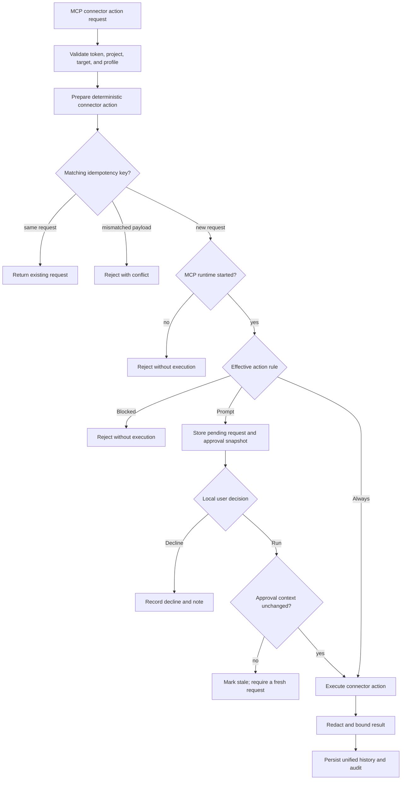

# MCP Permission Flow

An MCP client connects to the gateway with an API token. The AI assistant never
sees SSH keys, database passwords, API keys, or raw connector credentials. It
only sees connector targets and connector actions allowed by the token.

The local UI has a global MCP Started/Stopped switch for the active database
runtime. Saved connector permissions stay in the encrypted database, but new MCP
connector action execution is blocked while the runtime is stopped. This
prevents a gateway restart from automatically making old `always_run` grants
live again.

Current MCP tools:

```txt
list_connector_targets()
get_connector_help(target_ref)
get_connector_actions(target_ref)
call_connector_action(target_ref, action_name, input?, reason?, idempotency_key)
get_connector_action_request(request_id)
list_vault_items(project_ref?)
call_vault_action(project_ref, action_name, input, reason, idempotency_key)
get_vault_action_request(request_id)
cancel_vault_action_request(request_id)
```

For the detailed tool contract, see [MCP Tools](../api/mcp-tools.md).

## Target Discovery

`list_connector_targets()` returns only target/profile refs that are inside an
enabled token project and have an effective action grant. Temporary grants
include `expires_at`; expired grants are omitted.

Example:

```json
[
  {
    "target_ref": "ssh:3:1",
    "project_id": 2,
    "project_name": "My Project",
    "project_slug": "my-project",
    "target_name": "core-1",
    "connector_kind": "ssh",
    "profile_label": "admin",
    "actions": [{ "name": "exec", "execution_rule": "approval_required" }]
  }
]
```

Target visibility is not a live health check. A visible SSH target may still be
powered off, unreachable, reject authentication, or require host-key review.
Execution errors are the current reachability signal.

## Action Execution

Example call:

```json
{
  "target_ref": "ssh:3:1",
  "action_name": "exec",
  "input": { "command": "ls" },
  "reason": "Inspect the current directory.",
  "idempotency_key": "inventory-core-1-2026-08-11"
}
```

Gateway flow:

1. Validate the API token.
2. Reject revoked or expired tokens.
3. Resolve the connector target, project, and credential profile.
4. Require that project to be enabled for the token.
5. Prepare the connector action.
6. Check token permission for target/profile/action.
7. Return the original request when a matching idempotency key is replayed, or
   reject a mismatched reuse with `409 Conflict`.
8. Reject expired action grants.
9. Check whether the global MCP runtime is started.
10. If the runtime is stopped, return a stopped/error response.
11. If the rule is `always_run`, execute the connector action.
12. If the rule is `approval_required`, create a pending connector action approval.
13. If the rule is `blocked`, reject the action without execution.
14. Record project-snapshotted history and audit events.



No branch exposes connector credentials to the MCP client. Prompt and Always
converge on the same connector execution, redaction, history, and audit path;
only the local decision step differs.

## Approval Required

Approval-required MCP requests are non-blocking. The gateway stores the
connector action request as `approval_pending` and returns `request_id`. The
user decides in the web UI:

- Run
- Decline
- Add a note

When a pending approval is created, the gateway snapshots the approval context:
token identity, project identity and scope, connector target, credential
profile, token action permission,
connector metadata, action input, and prepared payload hash. When the user
clicks Run, the gateway recomputes that context before execution. If it
changed, the request becomes `stale` and the AI must submit a fresh connector
action request.

When the user runs a non-stale request, the backend executes the connector
action through the same connector runtime used by `always_run`. The AI follows
progress with `get_connector_action_request(request_id)`.

When the user declines the request, the decline note is stored on the connector
action request and returned to the MCP client.

For credential rules, see [Credential Boundary](../security/credential-boundary.md).

## Project Vault Flow

Project Vault uses project capabilities instead of connector action grants.
Metadata listing requires `vault.metadata.read`; generation and session
application use `vault.item.generate` and `vault.session.apply`. Each mutation
capability may be Disabled, Prompt, or Always.

Vault mutations always create a tracked request containing non-secret metadata,
an action-context hash, and a caller-stable idempotency key. Prompt waits for a
local decision and expires after 15 minutes. Always executes immediately
without the local decision. Both paths revalidate token/project visibility,
capability rules and revisions, item revisions, target/profile/runtime identity,
and the exact current session before executing.

Secret values are never returned by MCP. A completed session-application result
is returned only while the exact session lease and current authorization remain
valid. Capability or item drift stales pending requests; later polls with
insufficient authorization withhold already-produced output.

See [Project Vault](../project-vault.md) for the complete boundary.
