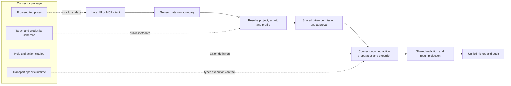

# Development Architecture

AIPermission is a monorepo because the gateway, frontend, MCP bridge, operator instructions, and docs share one security contract.

```txt
aipermission/
  backend/                  Go local gateway, connector runtime, and MCP API
  frontend/                 React web UI served by local nginx
  packages/mcp/             npm MCP bridge package
  packages/npm-placeholder/ unscoped npm placeholder package
  docs/                     product, API, security, and setup docs
```

## Runtime Shape

```txt
browser -> localhost frontend/nginx -> backend API -> encrypted SQLite + connector targets
MCP client -> localhost frontend/nginx -> backend /api/mcp/* -> connector targets
```

The backend is not a LAN service. Docker Compose publishes the UI on `127.0.0.1` by default, the backend binds to loopback, and nginx proxies `/api` internally. Backend origin checks and nginx Host validation also recognize `[::1]` for operators who explicitly publish the UI on IPv6 loopback; generated MCP configuration follows the loopback origin that opened the UI.

Connector targets use one shared security pipeline:

```txt
target + credential profile + action
  -> token permission
  -> approval policy
  -> connector execution
  -> history + audit
```



Adding a normal connector changes the connector package and its registration,
not the permission, approval, history, audit, or MCP tool families. A
runtime-integrated connector may additionally implement a reviewed typed
adapter, but the gateway still owns the same authorization and projection
boundaries.

SSH, Postgres, ClickHouse, Redis / Valkey, RabbitMQ, Kafka / Redpanda, S3, Docker, Kubernetes, and Mail are
built-in connectors that share the same target/profile, permission, approval,
history, and audit model. SSH owns a live terminal and file-transfer surface;
Postgres and ClickHouse own structured database actions; Redis / Valkey owns bounded
key-browser actions; RabbitMQ owns queue browsing and bounded message previews;
Kafka / Redpanda owns stream metadata, lag, bounded partition reads, and its
guarded publish/offset controls.
Mail owns bounded IMAP reads, explicit mailbox mutations, and guarded SMTP
submission through the same structured connector path.
Future connectors should add their own execution surface without adding a new
permission or audit pipeline.

The 0.2 connector line is treated as a clean connector-schema boundary. It is
allowed to make breaking local database changes while the project is still
pre-1.0, and the implementation should avoid long-term compatibility shims that
keep SSH outside the shared connector path. Pre-0.2 preview databases are not
migrated automatically by the normal gateway; users should create a fresh 0.2
database or use the versioned local migration helper for important 0.1.x data.
Keep migration code separate from runtime compatibility code.

Connector work has two classes:

| Capability | Normal structured connector | Runtime-integrated connector |
|---|---|---|
| Examples | Postgres, Redis / Valkey, API recipes | SSH live terminal and SFTP |
| Backend connector package | yes | yes |
| Frontend template folder | yes | yes |
| Shared target/profile/action permissions | yes | yes |
| Shared approval, history, and audit | yes | yes |
| New permission/history/audit tables | no | no |
| Generic route branches such as `kind == "redis"` | no | no |
| `connector_api_adapters.go` work | no | only after design review |
| Live console / file transfer / owned credential resources | no | adapter contract required |

If a connector cannot fit the normal structured path, treat that as a design
review signal before adding gateway-owned adapter capabilities. Adapter
capabilities must be expressed through the typed `internal/connectorapi`
interfaces so runtime-integrated connectors do not invent parallel server,
runtime, lifecycle, or credential-resource contracts.

Those contracts are consumer-owned capability ports, not a single gateway or
runtime facade. Connector adapters receive connector-kind-scoped target/profile
operations, encrypted-resource stores, resolved runtime secrets, live-session,
peer-identity, action-completion, transfer, or lifecycle capabilities only when
that operation needs them. Raw database handles, Vault handles, untyped resource
maps, the concrete runtime, and the concrete gateway must never cross this
boundary. Keep read-only peer identity access separate from trust-store mutation.
The connector API and API composition layer have regression tests for both the
declared interfaces and the concrete facade method sets; expanding one is an
architecture change that requires review.

Built-in runtime adapters are constructed explicitly. Each connector-owned
adapter package exposes a constructor, `internal/connectors/builtin` registers
those constructors beside the structured connector catalog, and the gateway
receives both registries as one catalog. Do not use package `init()` functions,
blank imports, or package-global adapter maps; explicit construction keeps test
instances isolated and makes the complete runtime surface reviewable in one
place.

## Backend Boundaries

- `internal/api`: HTTP routes, MCP authentication and delivery fencing, UI
  session/CSRF, audit adapters, and workspace lifecycle composition. Domain
  services own action, Vault-request, transfer-job, and runtime-state rules;
  handlers adapt those services to the unlocked database runtime.
- `internal/connectors`: connector contracts and built-in connector
  implementations. Connector packages describe target schemas, credential
  schemas, help/actions, validation, and execution. They do not own
  permissions, audit, or history.
- `internal/connectortargets`: connector target/profile/action storage plus the
  shared action request model.
- `internal/connectorruntime` and `internal/connectorresources`: gateway-owned,
  connector-kind-scoped runtime ports and encrypted resource stores. These
  packages retain raw core dependencies while adapters receive only distinct
  least-authority interface implementations.
- `internal/actions`: shared connector action preparation, approval-context
  snapshots and drift comparison, connector dispatch, and execution-result
  contract enforcement. Permission persistence and audit transaction ownership
  remain in the gateway application layer.
- `internal/actionresponse`: transport-neutral connector action response
  projection and output-withholding representation. The API decides whether a
  token/session may receive output and fences the response write; the facade
  decides how the already-safe request/result is represented.
- `internal/api/connector_api_adapters.go`: generic gateway resolution for
  connector-owned capability adapters. API handlers ask the resolved adapter
  whether a connector supports live-console runtime ids, draft tests, target
  operations, async finalization, or other gateway-owned behavior. They should
  not branch on a connector kind directly.
- `internal/history`: unified history projection for command, action, and file
  transfer activity.
- `internal/console`: persistent SSH console sessions, PTY websocket attach, AI command execution inside a shell session, transcript display cleanup, and transcript redaction before persistence. Console persistence uses a bounded session snapshot plus append-only transcript chunks so long-running sessions do not rewrite one large transcript row on every flush.
- `internal/db`: SQLCipher open, schema migrations, database catalog, encrypted database lifecycle.
- `internal/tokens`: API token create/hash/revoke/permission storage.
- `internal/connectors/ssh/sshkeys`: gateway-owned SSH key generation, explicit private key import, and vault-backed private key storage used by the SSH connector.
- `internal/connectors/ssh/sshconfig`: conservative SSH config host discovery/parsing for SSH connector form prefill.
- `internal/connectors/ssh/execution`: SSH command execution, SFTP file
  transfer primitives, and host key verification owned by the SSH connector.
- `internal/filetransfer`: file transfer history metadata, progress, status, and
  checksum storage. File contents are not stored in SQLCipher.
- `internal/transferjobs`: file/batch cancellation and pause gates isolated per
  unlocked runtime, plus terminal persistence recovery through narrow storage
  ports. Runtime shutdown closes the registry and immediately cancels late
  registrations. API routes keep permission, adapter dispatch, and audit
  responsibility; `transferjobs` owns cancellation concurrency and the rule
  that an uncertain local finalization must never turn a possibly completed
  remote transfer into a retry-safe failure. A pause cycle uses one broadcast
  channel so canceled waiters do not accumulate while a batch remains paused.
- `internal/vault`: AES-GCM secret payload encryption inside the SQLCipher database.
- `internal/projectvault`: Project Vault item metadata, encrypted values,
  project sharing, default session bindings, and exact-session item tracking.
- `internal/sessionenv`: framed one-time session environment envelopes and
  acknowledgement parsing. It never persists plaintext values.
- `internal/vaultrequests`: tracked Prompt/Always Project Vault action request
  lifecycle, idempotency, expiry, cancellation, stale transitions, and the
  claim/effect/finalize/repair/compensation workflow. API ports add transactional
  audit and encrypted Vault effects without merging this flow with connector
  action persistence.
- `internal/vaultsessions`: in-memory exact-session authorization leases for
  Project Vault application. SQL rows persist lease lifecycle/revocation
  metadata only; authorization is never restored after gateway restart.
- `internal/runtimecontrol`: concurrency-safe per-workspace MCP availability
  state. Saved token permissions and the live Started/Stopped switch remain
  separate concepts.

`internal/vault` is the low-level encryption primitive used by credentials and
other encrypted payloads. Project Vault is the user-facing project secret
inventory built in `internal/projectvault`; do not merge these responsibilities.
Project Vault requests also remain distinct from connector action requests:
connector actions execute one connector-owned action against one target/profile,
while Vault requests authorize project-scoped secret inventory changes or
cross-connector session environment delivery. They may share orchestration
helpers, but must not share a persistence model that erases those different
authorization and compensation boundaries.

Large API files should be split by behavior before they become cross-domain modules. Runtime-heavy domains should move out of `internal/api` when possible; `internal/console` is the first example of that boundary. Prefer small handler/service files such as `mcp_auth.go`, `command_requests.go`, `command_request_queries.go`, and connector adapter files. Route handlers should usually hang off small handler groups (`mcpHandlers`, `tokenHandlers`, `consoleHandlers`) instead of adding every endpoint directly to `*Server`.

Credential edits share the transaction-owned `updatePreparedCredentialProfile`
operation. It encrypts replacement material, checks the expected secret revision,
updates the profile, and reconciles runtime surfaces in the caller's transaction.
The caller retains its own audit events and post-commit invalidation; do not move
either domain writes or audit outbox writes outside that transaction. Metadata-only
edits must not rewrite ciphertext or advance the secret revision.

Production-size and dependency budgets are release gates, not aspirational
documentation. Connector source files have a tighter ceiling than general Go
files, backend package totals are bounded, and the architecture suite rejects
new internal import fan-out or dependency cycles. Composition-root exceptions
must be explicit and should move downward when responsibilities leave the API
package; do not raise a ceiling merely to land a feature.

## Frontend Boundaries

- `src/pages`: route-level pages.
- `src/components`: reusable UI and domain components.
- `src/lib`: API client, gateway context, hooks, and shared helpers.
- `src/connectors/templates`: connector UI templates. Each connector kind owns
  its form, credential form, row actions, console surface, toolbar actions, and
  display model.

Keep token connector-action permission logic in shared hooks such as
`useConnectorPermissions` instead of duplicating it between Console and Tokens
pages.

Route-level pages should render connector-specific UI through
`src/connectors/templates/registry.jsx`. Avoid adding new `if kind === "..."`
branches to pages when the behavior belongs to a connector template.

## MCP Package

`packages/mcp` is published as `@aipermission/mcp`. It should stay small:

- CLI entrypoint
- registry-driven client config and native skill installers
- scoped one-command setup and secret-safe setup diagnostics
- MCP stdio server
- bundled native operator skill and protocol-level server instructions
- tests for config writing and skill installation

The unscoped `aipermission` npm package is only a placeholder that points users to `@aipermission/mcp`.
